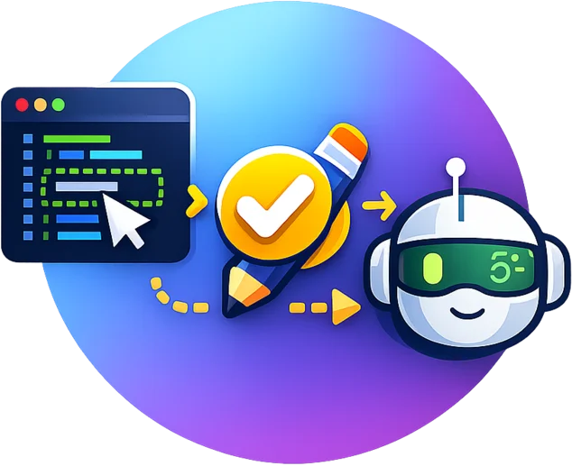
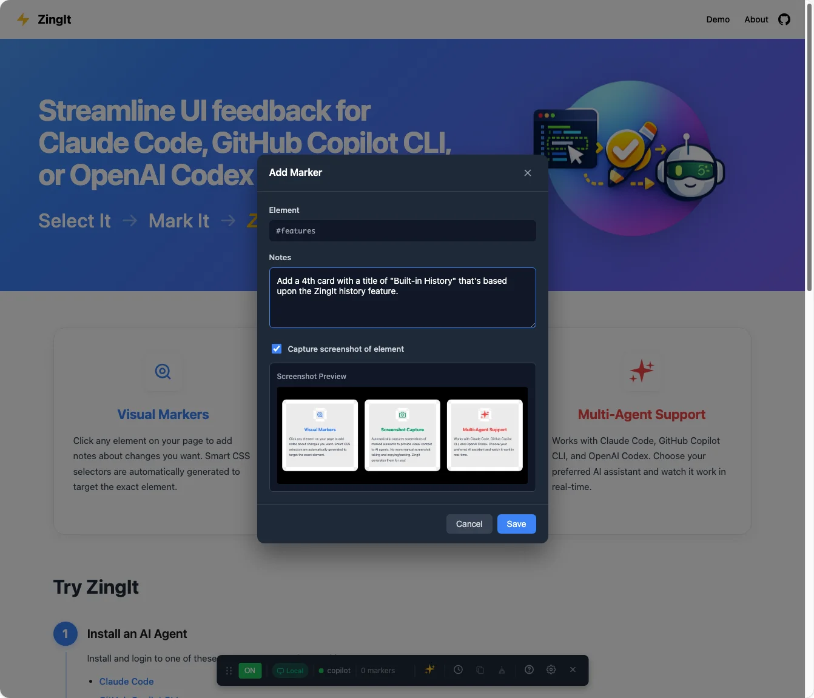
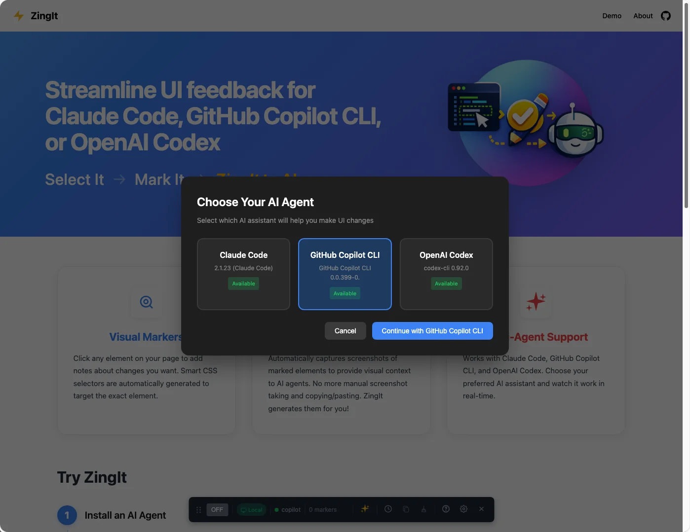

<div align="center">
  


# ZingIt

[Features](#features) | [Quick Start](#quick-start) | [Usage](#usage) | [Configuration](#configuration) | [Troubleshooting](#troubleshooting)

</div>

#### Point-and-click UI feedback that gets automatically implemented by AI

Tired of describing what element to change in the UI, taking screenshots, and copying/pasting them into your AI assistant? Streamline how you share UI changes! Select elements, mark them with the changes you want to make, and send directly to AI agents for automated fixes.

**Point → Click → Describe → ZingIt to AI**

**[Try the Live Demo →](https://danwahlin.github.io/zingit)**

## Features

### Visual Markers
Click any element on your page to add notes about changes you want. Smart CSS selectors are automatically generated to target the exact element.


### Screenshot Capture
Automatically captures screenshots of marked elements to provide visual context to AI agents. No more manual screenshot taking!



### Multi-Agent Support
Works with Claude Code, GitHub Copilot CLI, and OpenAI Codex. Choose your preferred AI assistant and watch it work in real-time.



### Send Changes with a Click
Once you've marked your changes, simply click the sparkle icon (✨) in the ZingIt toolbar to send everything to your AI agent. Watch as it generates code updates live!


### Additional Features
- **Real-time Streaming** - Watch the AI work in real-time
- **Smart Selectors** - Auto-generates CSS selectors for precise targeting
- **Change History** - Track all modifications made by your AI assistant
- **Remote/Local Detection** - Warns when editing published sites vs local development

## Quick Start

### Option 1: Clone the Repo and Run Locally

1. **Install an AI agent** - Install and login to one of these AI agents on your dev machine:

   - [Claude Code](https://github.com/anthropics/claude-code)
   - [GitHub Copilot CLI](https://github.com/github/copilot-cli)
   - [OpenAI Codex](https://github.com/openai/codex)

2. **Clone and setup**:

```bash
git clone https://github.com/danwahlin/zingit.git
```

3. **Start the ZingIt server** (in one terminal):

```bash
cd zingit/server
npm install
npx cross-env PROJECT_DIR=../client npm run dev
```

Server runs on `ws://localhost:3000`

4. **Run the demo site** (in another terminal):

```bash
cd zingit/client
npm install
npm run dev
```

5. Visit [http://localhost:5200/?zingit](http://localhost:5200/?zingit) to see ZingIt in action!

6. You'll be prompted to select an AI agent. Start marking!

### Option 2: Add to Your Website

1. **Start the ZingIt server**:

```bash
npx cross-env PROJECT_DIR=/path/to/your/project npx @codewithdan/zingit
```

Replace `/path/to/your/project` with your project path.

2. **Add the ZingIt script** to your HTML pages just before the closing `</body>` tag:

```html
<script src="https://cdn.jsdelivr.net/npm/@codewithdan/zingit@latest/dist/zingit-client.js"></script>
```

3. **Run your website's dev server** and visit it with `?zingit` added to the URL.

Example: `http://localhost:5200/?zingit`

## Usage

1. **Press `Z`** to toggle mark mode on/off
2. **Click elements** on your page to mark them - add notes about changes you want
3. **Click the sparkle icon** (✨) in the toolbar to send markers to your AI agent
4. **Watch the agent work** in real-time - the response panel shows streaming updates

### Toolbar Icons

| Icon | Description |
|------|-------------|
| **ON/OFF** | Toggle mark mode |
| **✨** (Sparkle) | Send markers to AI agent |
| **🕒** (Clock) | View change history |
| **📋** (Copy) | Export markers as Markdown |
| **🧹** (Broom) | Clear all markers |
| **?** | View keyboard shortcuts |
| **⚙️** (Gear) | Open settings |
| **✕** | Close ZingIt toolbar |

### Keyboard Shortcuts

| Key | Action |
|-----|--------|
| `Z` | Toggle mark mode on/off |
| `Ctrl/Cmd+Z` | Undo last marker |
| `?` | Show help overlay |
| `` ` `` | Toggle ZingIt visibility |
| `Esc` | Close current panel/modal |
| `Ctrl/Cmd+Enter` | Save marker (in modal) |

## Configuration

Click the **gear icon** for settings:

| Setting | Default | Description |
|---------|---------|-------------|
| WebSocket URL | `ws://localhost:3000` | Server connection |
| Project Directory | *(server default)* | Override project path |
| Highlight Color | `#fbbf24` | Element highlight color |
| Marker Color | `#3b82f6` | Marker badge color |

## Architecture

```
zingit/
├── client/          # Lit web components (browser UI)
│   ├── src/components/  # UI components
│   ├── src/services/    # WebSocket, storage
│   └── dist/            # Built bundle
└── server/          # WebSocket server + AI agents
    └── src/agents/  # Claude, Copilot, Codex integrations
```

## Troubleshooting

**WebSocket not connected**
- Ensure server is running: `npx cross-env PROJECT_DIR=/path npx @codewithdan/zingit`
- Check WebSocket URL in settings (default: `ws://localhost:3000`)
- Make sure you've added `?zingit` to your URL

**Agent not responding**
- Verify AI agent is installed and authenticated
- Check server logs for error messages

**Markers not persisting**
- Markers are URL-specific and stored in localStorage
- Changing pages clears markers

**Changes not appearing on published site**
- If you see a "Remote" badge in the toolbar, you're editing a published site
- Changes are saved locally only - to see them, run the project locally or deploy the updated files
- For best experience, use ZingIt with local development (localhost)

## License

MIT

---

**Made by [Dan Wahlin](https://github.com/danwahlin)** | [Issues](https://github.com/danwahlin/zingit/issues) | [Contributing](CONTRIBUTING.md)
